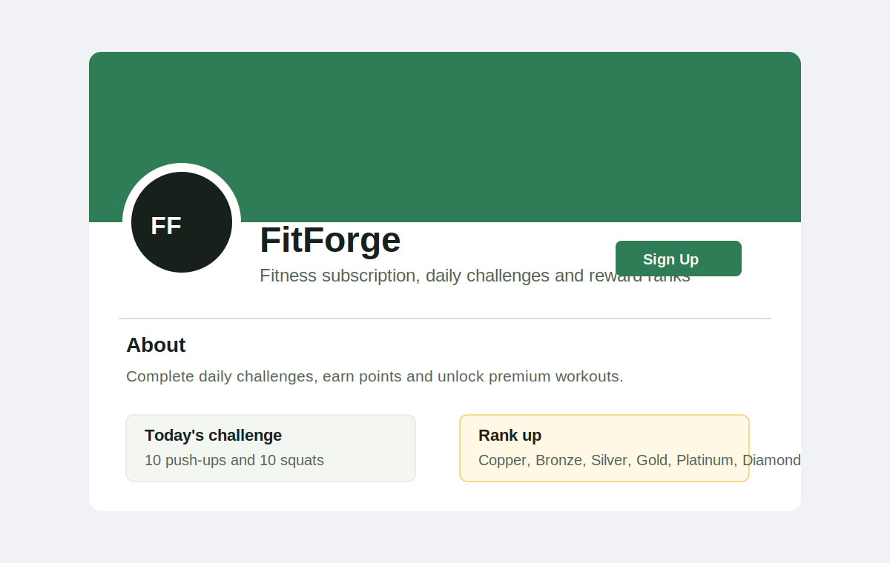

# FitForge

FitForge is a full-stack fitness subscription and e-commerce application. Members can buy workout and nutrition products, start a membership, complete daily challenges, complete workouts, earn rank points, and share community progress.

## Project Purpose

FitForge is designed for people who want structure, motivation, and accountability when building fitness habits. The site owner can sell individual products while also encouraging recurring revenue through membership access to premium workouts and member features.

## Target Users

- New fitness users who want beginner-friendly challenges and plans.
- Returning members who want daily motivation and reward progress.
- Customers who want to buy workout plans, nutrition guides, or merchandise.
- Site owners/admins who need to manage products, workouts, challenges, orders, and community content.

## E-commerce Business Model

FitForge uses a mixed e-commerce model:

- One-off purchases: workout plans, nutrition guides, and merchandise.
- Membership subscription: unlocks premium workouts and gives members extra motivation through rewards.
- Retention strategy: daily challenges, workout completions, and rank progression encourage users to return.
- Marketing strategy: newsletter signup, social media page/mockup, SEO metadata, sitemap, and robots.txt.

## Current Features

- User registration, login, logout, and dashboard.
- User profile with goal, experience level, dietary preference, training style, and bio.
- Rank system based on reward points: No Rank, Copper, Bronze, Silver, Gold, Platinum, Diamond.
- Daily challenge completion with one reward claim per challenge.
- Workout library with workout completion points.
- Premium workout locking based on active membership.
- Product catalogue, shopping bag, checkout, and order success feedback.
- Membership activation flow with membership reward points.
- Community progress posts with create, read, update, and delete functionality.
- Product reviews with create/update and delete functionality.
- Newsletter signup form with consent.
- SEO features: meta descriptions, site title, sitemap.xml, robots.txt, custom 404 page.
- External health guidance link using `target="_blank"` and `rel="noopener noreferrer"`.

## Reward System

Ranks are based only on total points. Users earn points from actions:

| Action | Points |
| --- | ---: |
| Complete profile | 20 |
| Complete daily challenge | 15 |
| Complete workout | 30+ |
| Create progress post | 10 |
| Leave product review | 10 |
| Complete purchase | 25 |
| Start membership | 50 |

| Rank | Points |
| --- | ---: |
| No Rank | 0 |
| Copper | 50 |
| Bronze | 150 |
| Silver | 300 |
| Gold | 500 |
| Platinum | 800 |
| Diamond | 1200 |

## Data Models

Custom models include:

- `UserProfile`
- `RewardEvent`
- `DailyChallenge`
- `ChallengeCompletion`
- `WorkoutPlan`
- `WorkoutCompletion`
- `Product`
- `Order`
- `OrderLineItem`
- `Membership`
- `ProgressPost`
- `Review`
- `NewsletterSignup`

These models support clear relationships between users, rewards, products, orders, memberships, workouts, challenges, community posts, and reviews.

## SEO And Marketing

- Each main page includes a descriptive meta description.
- `robots.txt` controls crawler access and points to the sitemap.
- `sitemap.xml` lists core public pages.
- A custom 404 page redirects users back to the home page.
- Newsletter signup supports email marketing.
- Facebook business page mockup evidence is stored in `docs/facebook_business_page_mockup.svg`.



## Agile Development Evidence

Development is recorded through small Git commits. Planned GitHub issue labels:

- `feature`
- `bug`
- `testing`
- `documentation`
- `must-have`
- `should-have`
- `could-have`

Suggested user story examples:

- As a visitor, I can register for an account so that I can access member features.
- As a member, I can complete a daily challenge so that I can earn rank points.
- As a member, I can complete a workout so that I can track training progress.
- As a customer, I can add products to a bag and checkout so that I can purchase fitness content.
- As a member, I can create, edit, and delete progress posts so that I control my community updates.
- As a site owner, I can manage products, workouts, and challenges so that the site content stays current.

## Testing

Automated tests currently cover rewards, daily challenges, checkout, and community post permissions.

Run tests:

```bash
python manage.py test
```

Detailed automated and manual testing evidence is recorded in [TESTING.md](TESTING.md).

## Local Setup

```bash
python -m venv .venv
.venv\Scripts\activate
pip install -r requirements.txt
python manage.py migrate
python manage.py loaddata sample_products sample_workouts sample_challenges
python manage.py runserver
```

For local development, set `DEBUG=True` in your environment. The project defaults to `DEBUG=False` for safer deployment practice.

## Deployment Notes

Before final deployment:

- Set `SECRET_KEY`, `DEBUG=False`, `ALLOWED_HOSTS`, `DATABASE_URL`, `STRIPE_PUBLIC_KEY`, and `STRIPE_SECRET_KEY`.
- Run migrations on the deployed database.
- Run `collectstatic`.
- Confirm all internal links work.
- Confirm payment behaviour works with Stripe test keys.
- Update `sitemap.xml` from localhost to the deployed domain.

## Credits

- Django framework documentation.
- Stripe Python package for payment integration.
- NHS exercise guidance linked in the site footer.
